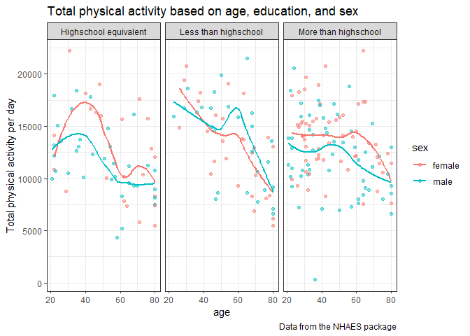
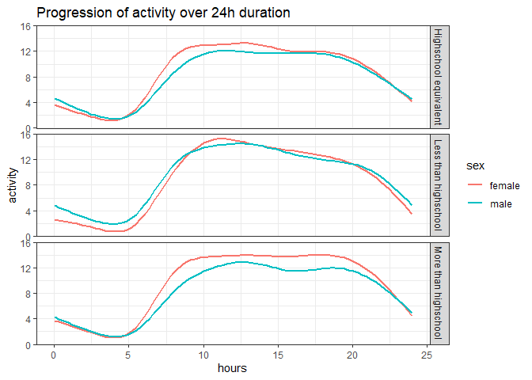

hw3_tpd2121
================
2024-10-12

Initializing the packages

``` r
library(tidyverse)
```

    ## ── Attaching core tidyverse packages ──────────────────────── tidyverse 2.0.0 ──
    ## ✔ dplyr     1.1.4     ✔ readr     2.1.5
    ## ✔ forcats   1.0.0     ✔ stringr   1.5.1
    ## ✔ ggplot2   3.5.1     ✔ tibble    3.2.1
    ## ✔ lubridate 1.9.3     ✔ tidyr     1.3.1
    ## ✔ purrr     1.0.2     
    ## ── Conflicts ────────────────────────────────────────── tidyverse_conflicts() ──
    ## ✖ dplyr::filter() masks stats::filter()
    ## ✖ dplyr::lag()    masks stats::lag()
    ## ℹ Use the conflicted package (<http://conflicted.r-lib.org/>) to force all conflicts to become errors

``` r
library(ggridges)
```

## Problem 2

2A. Loading the dataset

``` r
demography = read.csv("./nhanes_covar.csv", 
                      skip = 4) %>% 
  drop_na()
acc_data = read.csv("./nhanes_accel.csv")
```

Cleaning the dataset

``` r
#checking data
anti_join(demography, acc_data)
```

    ## Joining with `by = join_by(SEQN)`

    ## [1] SEQN      sex       age       BMI       education
    ## <0 rows> (or 0-length row.names)

``` r
#joining the dataset
complete_acc = 
  full_join(demography, acc_data, by = "SEQN") %>% 
  filter(age >21) %>% 
  mutate(
    sex = as.character(sex),
    sex = case_match(
      sex,
      "1" ~ "male",
      "2" ~ "female"), 
    education = as.character(education),
    education = case_match(
      education,
      "1" ~ "Less than highschool",
      "2" ~ "Highschool equivalent",
      "3" ~ "More than highschool"
    )
  )
```

2B. Creating table and visualization for gender, education, and age

``` r
complete_acc %>% 
  group_by(sex, education) %>% 
  summarize(count = n()) %>% 
  pivot_wider(names_from = "education", values_from = "count") %>% 
  knitr::kable()
```

    ## `summarise()` has grouped output by 'sex'. You can override using the `.groups`
    ## argument.

| sex    | Highschool equivalent | Less than highschool | More than highschool |
|:-------|----------------------:|---------------------:|---------------------:|
| female |                    23 |                   28 |                   59 |
| male   |                    34 |                   27 |                   54 |

``` r
complete_acc %>% 
  group_by(sex, education, age) %>% 
  ggplot(aes(x = education, y = age, color = sex)) + 
  geom_boxplot() + 
  labs(
    title = "Age distribution based on education and sex")
```

<!-- -->

2C. Total activity over the day

``` r
total_df = 
  complete_acc %>% 
  mutate(
    act_total = rowSums(across(c(min1:min1440)))
    )%>% 
  select(SEQN:education, act_total)
```

``` r
ggplot(total_df, aes(x = age, y = act_total, color = sex)) + 
  geom_point(alpha = .5) +
  geom_smooth(se = FALSE) + 
  facet_grid(. ~ education) + 
  theme_bw() +
  labs(
    title = "Total physical activity based on age, education, and sex",
    y = "Total physical activity per day")
```

    ## `geom_smooth()` using method = 'loess' and formula = 'y ~ x'

<!-- -->

``` r
#do facet_grid (sex ~ education) if want to make 6 panel
```

Based on the plot, we can see that there is a difference in the total
activity based on age, education, and sex. For people who had education
lower than highschool equivalent, the highest total activity per day is
recorded at 30-50 years old group and decline afterwards. Female are
shown to have higher activies per day compared to male in this group.
People who have highschool equivalent education generally show
decreasing trend of physical activity as they got older. This decline is
more pronounced in female compared to male participants. There’s a jump
in activities recorded around 50 to 60 years of age, before declining
again. Lastly, in the people with higher than highschool education,
female participants’ have plateauing activities until age 60 before
declining. In male participants, there’s a slight dip from around age
20s to 40s, before slightly jumping up and declining again at around age
50.

2D. 3 panel plot Accelerometer data allows the inspection activity over
the course of the day. Make a three-panel plot that shows the 24-hour
activity time courses for each education level and use color to indicate
sex. Describe in words any patterns or conclusions you can make based on
this graph; including smooth trends may help identify differences. x
axis = minutes, y axis = mean activity, color line = sex, panel =
education

``` r
timecourse_df = 
  complete_acc %>% 
  select(-SEQN, -BMI, -age) %>% 
  group_by(sex, education) %>% 
  summarize(across(min1:min1440, mean)) %>% 
  pivot_longer(
    min1:min1440,
    names_to = "minutes",
    values_to = "activity"
    )
```

    ## `summarise()` has grouped output by 'sex'. You can override using the `.groups`
    ## argument.

``` r
ggplot(timecourse_df, aes(x = minutes, y = activity, color = sex)) + 
  geom_point(alpha = .5) +
  geom_smooth(se = FALSE) + 
  facet_grid(education ~ .) + 
  theme_bw()
```

    ## `geom_smooth()` using method = 'loess' and formula = 'y ~ x'

<!-- -->

``` r
#pretty sure have to convert the minutes to hours, then plot the hours to the data
```

## Problem 3

3A. Load and clean the data

``` r
jan_2020 = read.csv("./Jan 2020 Citi.csv") %>% 
  janitor::clean_names() %>%
  mutate(time = "jan_20") %>% 
  select(time, everything())

jan_2024 = read.csv("./Jan 2024 Citi.csv") %>% 
  janitor::clean_names() %>%
  mutate(time = "jan_24") %>% 
  select(time, everything())

jul_2020 = read.csv("./July 2020 Citi.csv") %>% 
  janitor::clean_names() %>%
  mutate(time = "jul_20") %>% 
  select(time, everything())

jul_2024 = read.csv("./July 2024 Citi.csv") %>% 
  janitor::clean_names() %>%
  mutate(time = "jul_24") %>% 
  select(time, everything())

citibike_df = 
  bind_rows(jan_2020, jan_2024, jul_2020, jul_2024)
```

There are 4 data set in the citibike folder. The January 2020 data
contains 12420, while the January 2024 data contains 18861 observations.
Meanwhile, the July 2020 data contains 21048 while the July 2024
contains 47156 observations. The variables on all data frame are quite
similar, which are time, ride_id, rideable_type, weekdays, duration,
start_station_name, end_station_name, member_casual, with the variable
`time` is an additional variable I created to help with merging the data
into `citibike_df`.

3B. Reader friendly table

3C. 5 popular stations

3D. Plot

3E. Electric bikes
