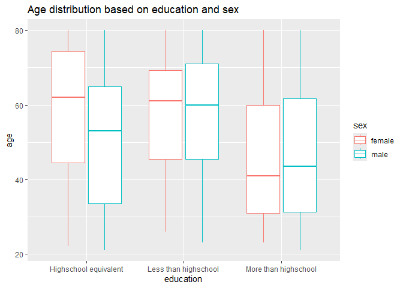

hw3_tpd2121
================
2024-10-12

Initializing the packages

``` r
library(tidyverse)
library(ggridges)
```

## Problem 2

**2A. Loading the dataset**

``` r
demography = read.csv("./nhanes_covar.csv", 
                      skip = 4) %>% 
  drop_na()
acc_data = read.csv("./nhanes_accel.csv")
```

Cleaning the dataset

``` r
#checking data
anti_join(demography, acc_data)
```

    ## [1] SEQN      sex       age       BMI       education
    ## <0 rows> (or 0-length row.names)

``` r
#joining the dataset
complete_acc = 
  full_join(demography, acc_data, by = "SEQN") %>% 
  filter(age >= 21) %>% 
  mutate(
    sex = as.character(sex),
    sex = case_match(
      sex,
      "1" ~ "male",
      "2" ~ "female"), 
    education = as.character(education),
    education = case_match(
      education,
      "1" ~ "Less than highschool",
      "2" ~ "Highschool equivalent",
      "3" ~ "More than highschool"
    )
  )
```

**2B. Creating table and visualization for gender, education, and age**

``` r
complete_acc %>% 
  group_by(sex, education) %>% 
  summarize(count = n()) %>% 
  pivot_wider(names_from = "education", values_from = "count") %>% 
  knitr::kable()
```

| sex    | Highschool equivalent | Less than highschool | More than highschool |
|:-------|----------------------:|---------------------:|---------------------:|
| female |                    23 |                   28 |                   59 |
| male   |                    35 |                   27 |                   56 |

Based on the table, we see that there are slightly more male than female
participants. Based on education we see that the highest number of
participants have education more than high school and there are slightly
more female than male in this category. The number of male and female
with less than high school education was around the same, but there are
more male compared to female in the high school equivalent category.

``` r
complete_acc %>% 
  group_by(sex, education, age) %>% 
  ggplot(aes(x = education, y = age, color = sex)) + 
  geom_boxplot() + 
  labs(
    title = "Age distribution based on education and sex")
```

<!-- -->

I chose boxplot because it’s able to show the distribution more clearly
compared to histogram or density plot. Looking at the
`more than high school` category, we see that despite female having
slightly more participants in the category compared to male, we see that
in terms of distribution, male have slightly older age compared to
female in the category based on the interquartile range of the boxplot.
For the `less than high school` category, the numbers and distribution
are similar for both male and female, but we see that male has younger
participants (longer bottom tail). And finally, for the
`high school equivalent`, we see that despite female having lower number
of participants, the interquartile range of the boxplot showed that
female participants in the category is older compared to male.

**2C. Total activity over the day**

``` r
total_df = 
  complete_acc %>% 
  mutate(
    act_total = rowSums(across(c(min1:min1440)))
    )%>% 
  select(SEQN:education, act_total)
```

``` r
ggplot(total_df, aes(x = age, y = act_total, color = sex)) + 
  geom_point(alpha = .5) +
  geom_smooth(se = FALSE) + 
  facet_grid(. ~ education) + 
  theme_bw() +
  labs(
    title = "Total physical activity based on age, education, and sex",
    y = "Total physical activity per day", 
    caption = "Data from the NHAES package")
```

<!-- -->

Using scatter plot, the data seems quite scattered and no pattern would
seem clear for us readers if not for the smooth trend line added to each
panel. Based on the plot, we can see that there is a difference in the
total activity based on age, education, and sex. For people who had
education `high school equivalent`, the highest total activity per day
is recorded at 30-50 years old group and decline afterwards. Female are
shown to have higher activities per day compared to male in this group.
People who have `less than high school equivalent` education generally
show decreasing trend of physical activity as they got older. This
decline is more pronounced in female compared to male participants.
There’s a jump in activities recorded around 50 to 60 years of age,
before declining again. Lastly, in the people with
`more than high school` education, female participants’ have plateauing
activities until age 60 before declining. In male participants, there’s
a slight dip from around age 20s to 40s, before slightly jumping up and
declining again at around age 50.

**2D. 3 panel plot**

``` r
timecourse_df = 
  complete_acc %>% 
  select(-SEQN, -BMI, -age) %>% 
  group_by(sex, education) %>% 
  summarize(across(min1:min1440, mean)) %>% 
  pivot_longer(
    min1:min1440,
    names_to = "minutes",
    names_prefix = "min",
    values_to = "activity"
    ) %>% 
  mutate(
    minutes = as.numeric(minutes),
    hours = minutes/60
    )
```

``` r
ggplot(timecourse_df, aes(x = hours, y = activity, color = sex)) + 
  geom_smooth(se = FALSE) + 
  facet_grid(education ~ .) + 
  theme_bw() + 
  labs(
    title = "Progression of activity over 24h duration")
```

<!-- -->

The line graph describe the progression of physical activity over 24
hours. The graph shows how physical activity corresponds to human
general activity patterns and generally have similar patterns across
education level. The observation start from hour 0, which is midnight,
and we see declining trend between until hour 5, which corresponds to
the early hours in the morning where people are going to bed/asleep. At
around 5 AM, people tend to wake up so we see increasing activity until
hour 20, or around 8 pm, when activities tend to slightly dip or plateau
as people finished working. Female generally has higher activities
compared to males, and people with less that high school education have
the highest activities measurement compared to the other 2 education
categories.

## Problem 3

**3A. Load and clean the data**

``` r
jan_2020 = read.csv("./Jan 2020 Citi.csv") %>% 
  drop_na() %>% 
  janitor::clean_names() %>%
  mutate(time = "jan_20") %>% 
  select(time, everything())

jan_2024 = read.csv("./Jan 2024 Citi.csv") %>% 
  drop_na() %>% 
  janitor::clean_names() %>%
  mutate(time = "jan_24") %>% 
  select(time, everything())

jul_2020 = read.csv("./July 2020 Citi.csv") %>% 
  drop_na() %>% 
  janitor::clean_names() %>%
  mutate(time = "jul_20") %>% 
  select(time, everything())

jul_2024 = read.csv("./July 2024 Citi.csv") %>% 
  drop_na() %>% 
  janitor::clean_names() %>%
  mutate(time = "jul_24") %>% 
  select(time, everything())

citibike_df = 
  bind_rows(jan_2020, jan_2024, jul_2020, jul_2024)
```

There are 4 data set in the citibike folder. The January 2020 data
contains 12398 observations, while the January 2024 data contains 18799
observations. Meanwhile, the July 2020 data contains 21013 observations
while the July 2024 contains 47043 observations. The variables on all
data frame are quite similar, which are time, ride_id, rideable_type,
weekdays, duration, start_station_name, end_station_name, member_casual,
with the variable `time` is an additional variable I created to help
with merging the data into `citibike_df`.

**3B. Reader friendly table**

``` r
citibike_df %>% 
  group_by(time, member_casual) %>% 
  summarize(count = n()) %>% 
  pivot_wider(names_from = "time", values_from = "count") %>% 
  knitr::kable()
```

| member_casual | jan_20 | jan_24 | jul_20 | jul_24 |
|:--------------|-------:|-------:|-------:|-------:|
| casual        |    980 |   2094 |   5625 |  10843 |
| member        |  11418 |  16705 |  15388 |  36200 |

From this table, we can see that in citibike members have higher
ridership compared to casual riders from these 4 time points. We also
see that while member ridership are increasing, the casual riders have a
steep drop from `jul_20` to `jan_24`.

**3C. 5 popular stations**

``` r
jul_2024 %>% 
  group_by(start_station_name) %>% 
  count(start_station_name, name = "ride_count") %>% 
  arrange(desc(ride_count)) %>% 
  filter(ride_count >= 145) %>% 
  knitr::kable(
    col.names = c("Origin Station Name", "Number of Rides")
  )
```

| Origin Station Name      | Number of Rides |
|:-------------------------|----------------:|
| Pier 61 at Chelsea Piers |             163 |
| University Pl & E 14 St  |             155 |
| W 21 St & 6 Ave          |             152 |
| West St & Chambers St    |             150 |
| W 31 St & 7 Ave          |             145 |

**3D. Plot to investigate the effects of day of the week, month, and
year on median ride duration**

``` r
citibike_df %>% 
  group_by(time, weekdays) %>% 
  summarise(
    median = median(duration, na.rm = TRUE)) %>% 
  ggplot(aes(x = weekdays, y = median, color = time)) + 
  geom_point() +
  theme_bw() +
  theme(axis.text.x = element_text(angle = 45, hjust  =1),
        legend.position = "bottom") +
  facet_grid(.~ time) +
  labs(
    title = "Ride duration over week and 4 timepoints", 
    x = "days of the week",
    y = "median of ride duration")
```

<!-- -->

From the plot, we can see that `Jul_20` has the highest ridership median
compared to the other month-year timepoint, while `Jan_24` has the
lowest. Generally, Julys have higher ridership compared to Januarys.
When looking at the days, we see that Saturdays and Sundays generally
have the highest median across all month-year time points, except in Jan
24 where the highest median duration is on Friday and Saturday.

**3E. Electric bikes**

``` r
citibike_df %>% 
  group_by(time, rideable_type, member_casual) %>%
  select(time, rideable_type, member_casual, duration) %>% 
  filter(time %in% c("jan_24", "jul_24")) %>% 
  ggplot(aes(x = duration, fill = rideable_type)) + 
  geom_histogram(position = "dodge", binwidth = 2) + 
  theme_bw() +
  facet_grid(member_casual ~ time) + 
  labs(
    title = "Electric bikes ridership based on types of riders and time", 
    x = "ride duration",
    y = "n number of rides", 
    color = "types of riders")
```

<!-- -->

I used univariate plot, in this case histogram, since only 1 variable is
numerical variable. Based on the plot, we can see that members always
have higher ridership compared to casual riders and electric bikes have
higher ridership compared to non-electric bikes. In terms of duration,
Jul 2024 have longer ride duration for both members and casual riders
compared to Jan 2024.
